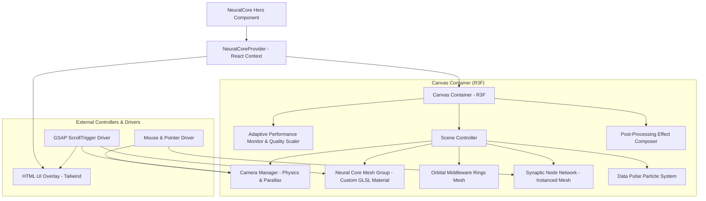

# Technical Architecture Specification: Neural Core 3D Hero

**Version:** 1.0.0  
**Stack:** React 18+ / Next.js 13+, TypeScript, Three.js, React Three Fiber (R3F), @react-three/drei, GSAP, Tailwind CSS  

---

## 1. High-Level System Architecture

The architecture is split into a **Core WebGL Engine**, a **React State/Config Provider**, and a **Semantic HTML Overlay Layer**. The design prioritizes modularity so that rendering subsystems (nodes, shaders, camera physics) can be reused across future 3D hero concepts.



---

## 2. Component & Reusable Layer Architecture

To support future 3D hero assets in the product line, code is structured into three layers:

1. **Foundational WebGL Utilities (`/src/core/3d`)**: Reusable Three.js abstractions, performance monitors, WebGL memory disposers, and math dampening hooks.
2. **Domain/Concept Subsystems (`/src/components/NeuralCore`)**: Specific 3D visual layers for the Neural Core product concept.
3. **Public Component Wrapper (`/src/index.ts`)**: React wrapper providing prop-to-uniform bindings, responsive fallbacks, SSR guards, and accessibility defaults.

---

## 3. Scene Architecture & Shaders

### 3.1 Neural Core Mesh
- **Geometry**: Procedural `IcosahedronGeometry` (detail level 4, 2,560 faces) or `DodecahedronGeometry`.
- **Shader Material (`NeuralCoreMaterial`)**:
  - **Vertex Shader**: Applies 3D Simplex noise deformation along vertex normals based on `uTime` and `uDataLoad` uniform.
  - **Fragment Shader**: Emissive fresnel edge highlighting blended with dynamic color gradients between `uPrimaryColor` and `uSecondaryColor`.

### 3.2 Orbital Middleware Rings
- Concentric `TorusGeometry` meshes rotated on off-axis Euler angles.
- Driven in `useFrame` with counter-rotational angular velocities.

### 3.3 Synaptic Node Network & Connections
- **Nodes**: Rendered via a single `InstancedMesh` (Sphere/Point geometry). Position, scale, and color matrices are updated via `InstancedBufferAttribute`.
- **Connections**: GPU dynamic lines created via `LineSegments` geometry or a custom shader reading from instance position buffer attributes, avoiding CPU array re-allocation loops.

### 3.4 Data Particle Pulses
- A dedicated pool of active particles traveling along synaptic path vectors.
- Uniform pulse progress `uPulseProgress` ($0.0 \to 1.0$) drives GLSL particle displacement along bezier curves.

---

## 4. Camera, Physics & Interaction System

### 4.1 Camera System
- **Base**: `PerspectiveCamera` (FOV: 45° desktop, 60° mobile; Near: 0.1, Far: 100).
- **Positioning**: Base position $(0, 0, 8)$, scrolling moves camera to $(0, 0, 1.5)$ (passing through rings toward inner core).

### 4.2 Pointer & Parallax Physics
- Uses `@react-three/fiber` `useFrame` + dampening math (`THREE.MathUtils.damp` / `maath/easing`).
- Mouse coordinates normalized to $[-1, 1]$.
- Camera target rotates slightly on $X$ and $Y$ axes with smooth spring dampening ($t = 0.05$).

---

## 5. Scroll Animation & Sync System

- Driven by **GSAP ScrollTrigger** attached to hero container section.
- **Scroll Sequence Timeline**:
  1. **$0\% \to 30\%$ Scroll**: Camera pans downward; headline text fades up; core rotation speeds up by $1.5\times$.
  2. **$30\% \to 70\%$ Scroll**: Camera zooms through outer orbital rings; subtext switches state; synaptic nodes flare up.
  3. **$70\% \to 100\%$ Scroll**: Camera enters core center; scene smoothly transitions opacity out into next page section.

---

## 6. Configuration API & State Management

Internal state is passed down via `NeuralCoreContext`. Props map directly to context values, which update shader uniforms and scene settings reactively.

```typescript
export interface NeuralCoreConfig {
  primaryColor: string;
  secondaryColor: string;
  backgroundColor: string;
  nodeCount: number;
  rotationSpeed: number;
  enableBloom: boolean;
  enableParallax: boolean;
  enableScrollScrub: boolean;
  reducedMotion: boolean;
}
```

---

## 7. Performance, Mobile & Accessibility Strategy

### 7.1 Performance Strategy
- **InstancedMesh**: All synaptic nodes rendered in 1 draw call.
- **DPR Lock**: `Math.min(window.devicePixelRatio, 2)` locked via R3F `Canvas`.
- **Adaptive Performance Scaler**: Monitors FPS via `usePerformanceMonitor` (Drei). If FPS drops below 45 for 60 consecutive frames:
  1. Automatically reduces `nodeCount` by 50%.
  2. Disables selective bloom post-processing.
- **Visibility Optimization**: Uses `IntersectionObserver`. When canvas is out of viewport, `frameloop="never"` is set to halt GPU rendering.
- **Memory Safety**: `useUnmountCleanup` hook walks scene graph and disposes geometries, materials, and WebGL render targets.

### 7.2 Mobile & Responsive Strategy
- Media query breakpoint detection ($< 768\text{px}$).
- Auto-scales camera FOV to fit phone screen bounds without geometry clipping.
- Touch drag events mapped to spring physics camera pan.

### 7.3 Reduced-Motion Strategy
- Detects `(prefers-reduced-motion: reduce)`.
- Disables GSAP camera scrubbing and pointer tracking.
- Locks scene rotation to a gentle 10% speed baseline.

---

## 8. Directory & File Architecture

```
3d-hero-lab/
├── docs/
│   ├── PRD.md
│   ├── Technical.md
│   ├── Design.md
│   └── ImplementationPlan.md
├── src/
│   ├── components/
│   │   ├── NeuralCore/
│   │   │   ├── NeuralCoreCanvas.tsx        # Main WebGL Canvas entry
│   │   │   ├── CoreMesh.tsx                # Inner GLSL noise deformed mesh
│   │   │   ├── OrbitalRings.tsx            # Middleware concentric rings
│   │   │   ├── SynapticNodes.tsx           # Instanced particle node network
│   │   │   ├── ConnectionLines.tsx         # GPU line segments
│   │   │   ├── DataPulses.tsx              # Particle burst path stream
│   │   │   ├── PostProcessing.tsx          # Bloom & chromatic aberration
│   │   │   └── HeroOverlay.tsx             # HTML text & CTA overlay
│   │   └── UI/                             # Shared UI buttons & indicators
│   ├── core/
│   │   ├── 3d/
│   │   │   ├── hooks/
│   │   │   │   ├── useMouseParallax.ts     # Reusable mouse tracking hook
│   │   │   │   ├── useScrollTimeline.ts    # Reusable GSAP scroll sync hook
│   │   │   │   └── useAdaptiveQuality.ts   # FPS scaling hook
│   │   │   ├── materials/
│   │   │   │   ├── NeuralCoreMaterial.ts   # Custom GLSL shader material
│   │   │   │   └── SynapsePulseMaterial.ts # Line pulse GLSL material
│   │   │   └── utils/
│   │   │       ├── disposeScene.ts         # Recursively purge GPU resources
│   │   │       └── mathHelpers.ts          # Matrix & vector interpolators
│   ├── context/
│   │   └── NeuralCoreContext.tsx           # Config state provider
│   ├── types/
│   │   └── neuralCore.ts                   # Public props & internal types
│   ├── styles/
│   │   └── neuralCore.css                  # Tailored CSS animations
│   └── index.ts                            # Public package export
└── README.md
```
